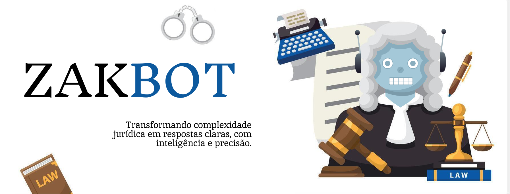
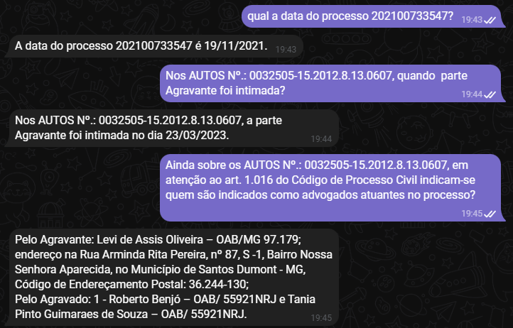
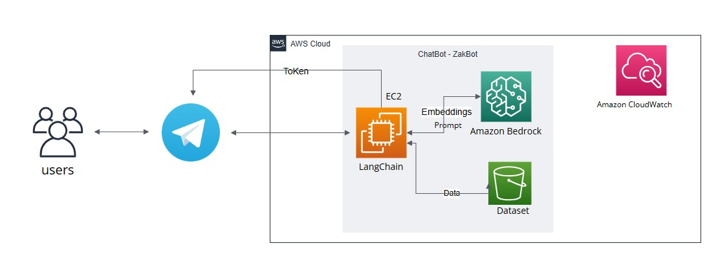

# ZakBot ⚖️🤖 

## 💻 Sobre o projeto

**[Zakbot](https://t.me/Zak3bot_bot)** foi desenvolvido para consulta de documentos jurídicos que utiliza inteligência artificial. Ele processa perguntas, busca respostas em documentos armazenados no S3 e responde via Telegram. Tecnologias como AWS Bedrock, LangChain e Chroma foram usadas, com monitoramento de logs no CloudWatch para garantir desempenho e segurança.

## 🤔 Como Utilizar 
**1. Clonar o Repositório:** 
```bash
git clone https://github.com/amandazzoc/zakbot-chat-juridico.git
```

**2. No terminal, navegue até a raiz do seu projeto (onde está o arquivo terraform):** 
```bash
cd infrastructure
```

**3. Configure as variáveis de ambiente da AWS** 
- Em chave de acesso escolha a aba PowerShell.
- Cole no terminal a primeira opção.

**4. Gere uma chave SSH**
```bash
ssh-keygen -t rsa -b 2048 -f ssh_dir
```
- Uma frase-senha (opcional). Pressione Enter para não usar senha.
- Confirmação do local para salvar. Pressione Enter se desejar salvar no local padrão ou forneça um caminho personalizado.
  
**5. Configure o .env**
- Em infrastructure/app consta o exemplo do arquivo .env necessário para a configuração.

**6. Inicie o Terraform**
```bash
terraform init
```

**7. Verifique o plano do Terraform**
```bash
terraform plan
```

**8. Aplicar a configuração do Terraform**
```bash
terraform apply
```
- O Terraform pedirá para confirmar a execução, você deve digitar yes para confirmar.
- Digite yes e o Terraform começará a provisionar os recursos especificados no arquivo main.tf.

**9. No console da AWS**
- No painel de navegação, acesse os Serviços e clique em EC2.
- No menu lateral esquerdo, clique em Instâncias.
- Na lista de instâncias EC2, localize a instância que você criou com o Terraform.

**10. Realize a conexão com a instância**
- Selecione a instância desejada.
- Selecione conectar no canto superior esquerdo.
- Permaneça na aba "Conexão de instância do EC2" e aperte em "Conectar".

**11. Configurações necessária para a máquina**
- Após a conexão, é uma boa prática garantir que o sudo esteja atualizado.
```bash
sudo app update -y
```

- Acesse a pasta /app
```bash
cd app
```

- Crie e acesse o ambiente virtual
```bash
python3.9 -m venv venv
source venv/bin/activate
```

- Instale as dependências necessárias
```bash
pip install --upgrade pip
pip install -r requirements.txt
```

**12. Configure as credenciais**
```bash
sso configure
```
- Informe a chave de acesso, a chave secreta, região e tipo de documento desejado.


**13. Execute o script do bot para iniciar o processo de interação com bot**
```bash
python app.py
``` 

- Para deixar o bot em produção, e conseguir deixar o terminal do EC2 fechado 
```bash
nohup  python app.py &
```
- Para finalizar a conexão, digite kill e numero gerado no comando anterior
```bash
kill <number>
```

**14. Interagir com o Bot no Telegram**
- Abra o aplicativo Telegram no seu dispositivo móvel ou no desktop.
- Na barra de pesquisa do Telegram, procure pelo bot @Zak3bot_bot, https://t.me/Zak3bot_bot.
- Para iniciar a conversa com o bot, digite /start.
- Para ter a lista de documentos e conseguir escolher sobre qual quer fazer a pergunta, digite /listar.
- Agora você pode começar a interagir com o bot enviando as perguntas.


**15. Para destruir os recursos do terraform**
```bash
terraform destroy
```


## 📦 Tecnologias 

- 
- 
- 
- 
- 
- 
- 
- 
- 
- 
-   
- 
- 


## ✅ Especificações

| **Tarefa** | **Status** |
|-----------------|------------|
| Configuração do Ambiente. |:heavy_check_mark:|
| Configuração do Bucket S3 para armazenamento dos documentos. |:heavy_check_mark:|
| Criação do Chatbot com LangChain e ChromaDB. |:heavy_check_mark:|
| Configuração do EC2 para integração. |:heavy_check_mark:|
| Integração com o Telegram Bot. |:heavy_check_mark:|
| Configuração do CloudWatch para registro de logs. |:heavy_check_mark:|
| Estrutura do Código. |:heavy_check_mark:|

## ⚙️ Arquitetura




## 🚨 Dificuldades do projeto 
  <table>
    <thead>
      <tr>
        <th>Desafios</th>
        <th>Solução</th>
      </tr>
    </thead>
    <tbody>
        <tr>
          <th>Encontrar bibliotecas que funcionassem corretamente</th>
          <th>Encontramos a solução lendo a documentação do Boto3 e do Langchain</th>
        </tr>
        <tr>
          <th>Criar key para que o terraform subisse para o EC2</th>
          <th>Usamos o seguinte comando no terminal: ssh-keygen -t rsa -b 2048 -f ssh_dir</th>
         <tr>
          <th>Fazer com o que os arquivos fossem enviados automaticamente ao subir a EC2</th>
          <th>Configuração do arquivo main.</th>
        </tr>
        <tr>
          <th>Configurar EC2 para que a maquina, mesmo depois de fechar o terminal, continuasse funcionando</th>
          <th>Solução: https://stackoverflow.com/questions/17385794/how-to-get-the-process-id-to-kill-a-nohup-process</th>
        </tr>
        <tr>
          <th>Fazer com que o bot respondesse de maneira clara e concisa</th>
          <th>Modificação do prompt e da maneira com que ele recebe e envia as respostas</th>
        </tr>
        <tr>
          <th>Erro com o StopSequence</th>
          <th>https://github.com/aws/aws-sdk/issues/692</th>
        </tr>
        </tr>
    </tbody>
  </table>


 ## 🔗 Estrutura de pastas 
```bash 
zakbot-chat-juridico/
├── assets/
│   ├── Arquitetura.jpg
│   ├── banner.png
│   ├── conversa.png
├── dataset/
│   ├── juridicos.zip
├── infrastructure/
├── .terraform/
├── app/
│   ├── aws_services/
│   │   ├── __pycache__/
│   │   ├── bedrock_service.py
│   │   ├── cloudwatch_logger.py
│   │   ├── s3_document_loader.py
│   ├── document_processing/
│   │   ├── __init__.py
│   │   ├── text_splitter.py
│   │   ├── vectorstore.py
│   ├── ssh_dir/
│   ├── telegram_bot/
│   │   ├── __init__.py
│   │   ├── bot_handler.py
│   │   ├── command_handler.py
│   ├── init.py
│   ├── .env.example
│   ├── .terraformignore
│   ├── app.py
│   ├── config.py
│   ├── requirements.txt
├── .gitignore
├── terraform.lock.hcl
├── main.tf
├── terraform.tfstate
├── terraform.tfstate.backup
├── README.md

```


## :bulb: Desenvolvedores 


<table>
 <tbody>
   <tr>
   <!-- Amanda Oliveira -->
   <td align="center"><a href="https://www.linkedin.com/in/amanda-oliveira-970410232/"><br /><sub><b>Amanda Oliveira</b></sub></a><br />
   <a/>
    <br/>
    <!-- Dionathan Araujo -->
    <td align="center"><a href="https://www.linkedin.com/in/dionathan-araujo-26b36b2b9/"><br /><sub><b>Dionathan Araujo</b></sub></a><br />
   <a/>
    <br/>
    <!-- Jéssica Fernandes -->
    <td align="center"><a href="https://www.linkedin.com/in/jessicafernandessilva/"><a href="https://www.linkedin.com/in/jessicafernandessilva/"><br /><sub><b>Jéssica Fernandes</b></sub></a><br />
   <a/>
    <br/>
    <!-- Wallisson Stevan -->
    <td align="center"><a href="https://www.linkedin.com/in/wallisson-stevan-985b9375/"><br /><sub><b>Wallisson Stevan</b></sub></a><br />
   <a/>
    <br/>
    </td>
    </tr> 
 </tbody>
</table>

